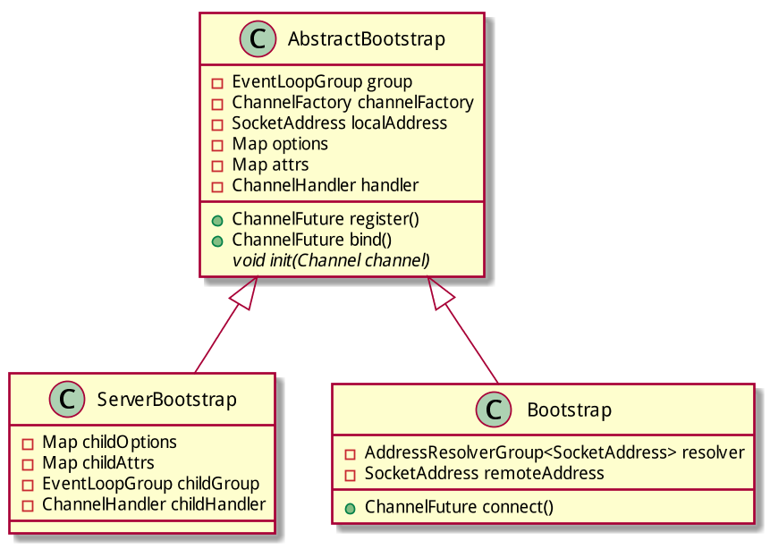

# Bootstrap

## Bootstrap的作用

Bootstrap的作用可以参考AbstractBootstrap的javadoc:

> AbstractBootstrap is a helper class that makes it easy to **bootstrap a Channel**.

Bootstrap存在的意义就是为了方便的"引导"Channel.

在netty中, 存在两种类型的Channel, 因此也对应有两种Bootstrap:

| channel类型 | 用于引导的bootstrap实现类 |
|--------|--------|
|    ServerChannel    |    ServerBootstrap    |
|   Channel     |    Bootstrap    |

## Bootstrap的继承结构

在netty的代码中, 类ServerBootstrap和类Bootstrap都继承自基类AbstractBootstrap:

