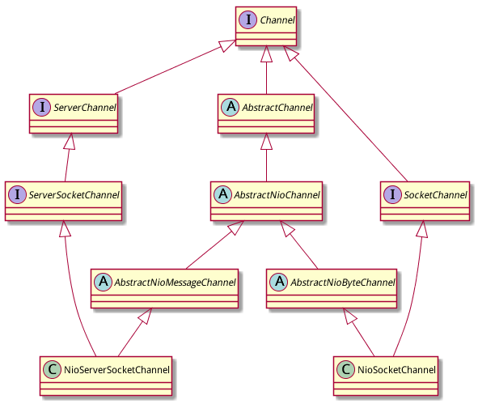

Channel接口的定义如下: 

```java
package io.netty.channel

public interface Channel extends AttributeMap, Comparable<Channel> {
}
```

继承了AttributeMap接口用于提供Attribute的访问, 继承了Comparable接口用于???

TBD: 继承Comparable接口是为什么?

## Channel接口方法定义

### 获取基础属性

- ChannelId id()
- Channel parent()
- ChannelConfig config()
- ChannelMetadata metadata(): 获取TCP参数配置

### 获取运行时属性

- EventLoop eventLoop()
- Channel.Unsafe unsafe()
- ChannelPipeline pipeline()
- ByteBufAllocator alloc()

### 获取状态

- boolean isOpen()
- boolean isRegistered()
- boolean isActive()
- boolean isWritable()

### 获取和网络相关属性

- SocketAddress localAddress()
- SocketAddress remoteAddress()

### 获取各种Future和Promise

- ChannelFuture closeFuture()
- ChannelPromise newPromise()
- ChannelProgressivePromise newProgressivePromise()
- ChannelFuture newSucceededFuture()
- ChannelFuture newFailedFuture(Throwable cause)
- ChannelPromise voidPromise()

### IO操作

- ChannelFuture bind(SocketAddress localAddress)
- ChannelFuture bind(SocketAddress localAddress, ChannelPromise promise)
- ChannelFuture connect(SocketAddress remoteAddress)
- ChannelFuture connect(SocketAddress remoteAddress, SocketAddress localAddress)
- ChannelFuture connect(SocketAddress remoteAddress, ChannelPromise promise)
- ChannelFuture connect(SocketAddress remoteAddress, SocketAddress localAddress, ChannelPromise promise)
- ChannelFuture disconnect()
- ChannelFuture disconnect(ChannelPromise promise)
- ChannelFuture close()
- ChannelFuture close(ChannelPromise promise)
- ChannelFuture deregister()
- ChannelFuture deregister(ChannelPromise promise)
- Channel read()
- ChannelFuture write(Object msg)
- ChannelFuture write(Object msg, ChannelPromise promise)
- Channel flush()
- ChannelFuture writeAndFlush(Object msg)
- ChannelFuture writeAndFlush(Object msg, ChannelPromise promise)


## Unsafe

在Channel接口内部定义了一个Unsafe接口, 然后提供了一个unsafe()用于或者这个Channel实例关联的Unsafe对象实例:

```java
public interface Channel extends AttributeMap, Comparable<Channel> {
	......
    Unsafe unsafe();
    ......
    interface Unsafe {......}
}
```
这个Unsafe接口相关的内容后面再详细讲.

## 其他Channel接口



在Channel继承结构中, ServerChannel/ServerSocketChannel/SocketChannel 三个interface继承自Channel.

### ServerChannel

ServerChannel 仅仅是一个标识接口, 没有任何实质内容. 代码也只是简单的有个申明:

```java
public interface ServerChannel extends Channel { }
```

### ServerSocketChannel

ServerSocketChannel从ServerChannel继承, 内容也很少,只是覆盖了几个定义在Channel的方法, 修改了函数的返回类型, 用更具体的子类型替代了Channel接口中定义的基础类型:

```java
public interface ServerSocketChannel extends ServerChannel {
    @Override
    ServerSocketChannelConfig config();			// return ChannelConfig in Channel
    @Override
    InetSocketAddress localAddress();			// return SocketAddress in Channel
    @Override
    InetSocketAddress remoteAddress();			// return SocketAddress in Channel
}
```

### SocketChannel

SocketChannel内容也不多:

1. 和ServerSocketChannel一样,覆盖了几个定义在Channel的方法, 修改了函数的返回类型, 用更具体的子类型替代了Channel接口中定义的基础类型:

    ```java
    public interface SocketChannel extends Channel {
        @Override
        ServerSocketChannel parent();			// return Channel in Channel

        @Override
        SocketChannelConfig config();			// return ChannelConfig in Channel
        @Override
        InetSocketAddress localAddress();		// return SocketAddress in Channel
        @Override
        InetSocketAddress remoteAddress();		// return SocketAddress in Channel
        ......
    ```

    注意 parent() 的修改, SocketChannel应该都是从ServerSocketChannel中accept得到,所以它的parent总应该是一个 ServerSocketChannel.

2. 定义了几个和socket相关的方法:

    ```java
    public interface SocketChannel extends Channel {
        ......
        boolean isInputShutdown();

        boolean isOutputShutdown();

        ChannelFuture shutdownOutput();

        ChannelFuture shutdownOutput(ChannelPromise future);
    ```