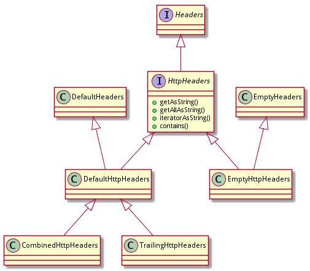

# header



## 接口HttpHeaders

提供访问HttpMessage的常用工具方法，继承自Headers，加了几个方法。

```java
public interface HttpHeaders extends Headers<CharSequence, CharSequence, HttpHeaders> {
    String getAsString(CharSequence name);
    List<String> getAllAsString(CharSequence name);
    Iterator<Entry<String, String>> iteratorAsString();
    boolean contains(CharSequence name, CharSequence value, boolean ignoreCase);
}
```

## 类DefaultHttpHeaders

```java
public interface HttpHeaders extends Headers<CharSequence, CharSequence, HttpHeaders> {
    String getAsString(CharSequence name);
    List<String> getAllAsString(CharSequence name);
    Iterator<Entry<String, String>> iteratorAsString();
    boolean contains(CharSequence name, CharSequence value, boolean ignoreCase);
}
```

TODO： 后面再细看validate的内容。

## 类EmptyHttpHeaders

没啥特别内容。

```java
public class EmptyHttpHeaders extends EmptyHeaders<CharSequence, CharSequence, HttpHeaders> implements HttpHeaders {
}
```

## 类CombinedHttpHeaders

CombinedHttpHeaders将多个相同名字的header合并到一个header，值为逗号分隔的多个值

```java
public class EmptyHttpHeaders extends EmptyHeaders<CharSequence, CharSequence, HttpHeaders> implements HttpHeaders {
}
```

## 类TrailingHttpHeaders

TrailingHttpHeaders是DefaultLastHttpContent中私有内嵌类，用于表示trunk编码中的trailing header:

```java
public class DefaultLastHttpContent{
    private static final class TrailingHttpHeaders extends DefaultHttpHeaders {
    }
}
```
