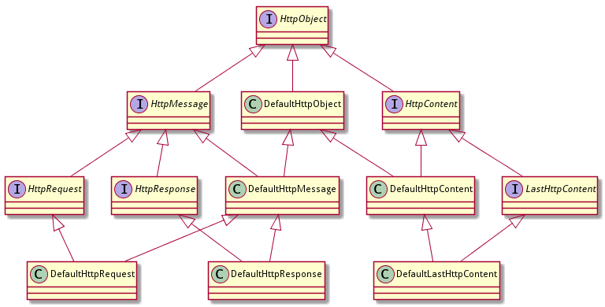
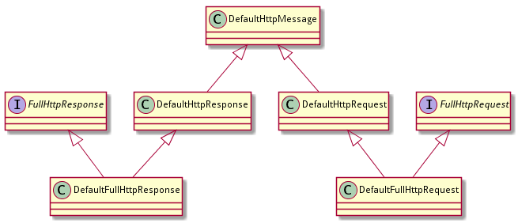

# http类实现

> 注：没啥特别内容，可以跳过。

## 基础实现类



### 类DefaultHttpObject

提供了类成员decoderResult，仅此而已。

```java
public class DefaultHttpObject implements HttpObject {
	private DecoderResult decoderResult = DecoderResult.SUCCESS;
}
```

### 类DefaultHttpMessage

提供了类成员version和headers，。

```java
public abstract class DefaultHttpMessage extends DefaultHttpObject implements HttpMessage {
    private HttpVersion version;
    private final HttpHeaders headers;
}
```

有两个细节，后面再看：

1. headers是final，但是version不是，而是有一个setProtocolVersion(HttpVersion version)方法可以用来设置
2. DefaultHttpMessage是抽象类，但是它继承的DefaultHttpObject却不是抽象类

```java
protected DefaultHttpMessage(final HttpVersion version, boolean validateHeaders, boolean singleFieldHeaders) {
    this.version = checkNotNull(version, "version");
    headers = singleFieldHeaders ?
    	new CombinedHttpHeaders(validateHeaders):
        new DefaultHttpHeaders(validateHeaders);
}
```

### 类DefaultHttpContent

提供成员变量content，这是一个ByteBuf。注意是final，构造函数初始化之后不再容许改动：

```java
public class DefaultHttpContent extends DefaultHttpObject implements HttpContent {
    private final ByteBuf content;
}
```

HttpContent继承自ByteBufHolder接口，就是对应这个ByteBuf，所有ByteBufHolder接口的方法实现都是操作这个ByteBuf，如：

```java
@Override
public HttpContent retain() {
    content.retain();
    return this;
}
```

### 类DefaultLastHttpContent

提供成员变量trailingHeaders，用于保存trunk编码中的trailing header：

```java
public class DefaultLastHttpContent extends DefaultHttpContent implements LastHttpContent {
    private final HttpHeaders trailingHeaders;
}
```

### 类DefaultHttpRequest

提供成员变量method和uri：

```java
public class DefaultHttpRequest extends DefaultHttpMessage implements HttpRequest {
    private HttpMethod method;
    private String uri;
}
```

### 类DefaultHttpResponse

提供成员变量status：

```java
public class DefaultHttpResponse extends DefaultHttpMessage implements HttpResponse {
    private HttpResponseStatus status;
}
```

总结：基础实现类基本没有特别的地方，按照继承结构简单实现而已。

## 全数据实现类



### 类DefaultFullHttpResponse

类DefaultFullHttpResponse继承自DefaultHttpResponse，为了实现FullHttpResponse接口，携带内容和trailingHeaders，增加了两个成员变量：

```java
public class DefaultFullHttpResponse extends DefaultHttpResponse implements FullHttpResponse {
    private final ByteBuf content;
    private final HttpHeaders trailingHeaders;
}
```

### 类DefaultFullHttpRequest

类似类DefaultFullHttpResponse，没啥特别内容。