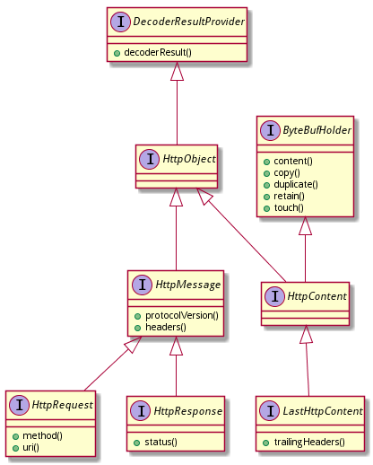
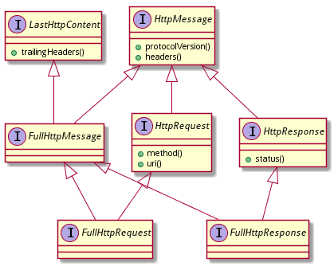
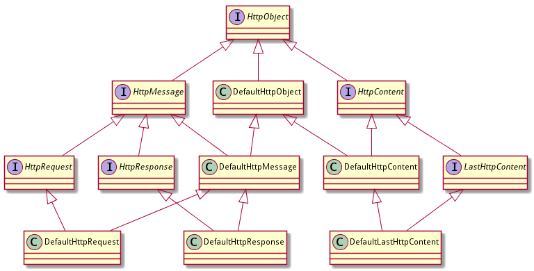
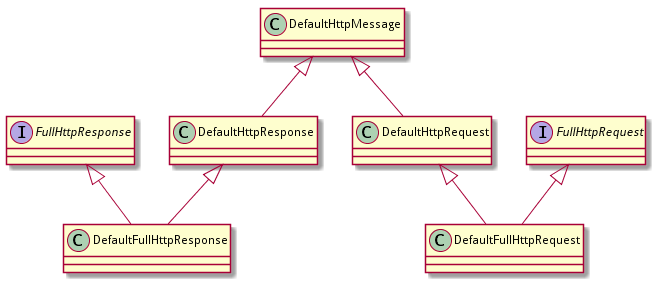

# http objects

为了表示HTTP中各种消息体，netty设计了一套完整的类型定义，包括接口和实现类。

由于类型比较多，部分实现类继承多个类和接口，关系有些复杂。我们按照接口先梳理一遍各个消息的基本情况，再看具体的类实现方式。

## HTTP接口定义

## 基础接口

我们先来看看HTTP的基本的接口定义。下图是netty中HTTP相关的6个接口的继承结构，还有他们继承的接口：



先简单过一下各个接口的情况：

1. HttpObject:

    ```java
    public interface HttpObject extends DecoderResultProvider { }
    ```

	这个接口是一个标识接口，本身没有定义任何东西。通过继承`DecoderResultProvider`提供了获取`DecoderResult`的方法。

2. HttpMessage: 定义HTTP消息，为`HttpRequest`和`HttpResponse`提供通用属性：

    ```java
    public interface HttpMessage extends HttpObject {
        HttpVersion protocolVersion();
        HttpHeaders headers();
    }
    ```

    所谓通用属性其实就只有两个：协议版本和header。

3. HttpRequest: 对应HTTP request。

	访问查询参数和cookie。和servlet api不同的是，query string通过QueryStringEncoder和QueryStringDecoder来构建和拆解。

    ```java
    public interface HttpRequest extends HttpMessage {
        HttpMethod method();
        String uri();
    }
    ```

	和HttpMessage相比，HttpRequest增加了http methed和uri两个参数。

4. HttpResponse：对应HTTP response.

    ```java
    public interface HttpRequest extends HttpMessage {
        HttpResponseStatus status();
    }
    ```

	和HttpMessage相比，HttpResponse增加了status参数。

5. HttpContent：是一个HTTP chunk，用于HTTP chunked 传输编码.

	当内容很大或者内容编码是chunked时，`HttpObjectDecoder`会在生成`HttpMessage`之后再生成`HttpContent`。如果不想在handler中接受到`HttpContent`，可以在`ChannelPipeline`中的`HttpObjectDecoder`之后放一个`HttpObjectAggregator`。

	`HttpContent`继承自`HttpObject`和`ByteBufHolder`：

    ```java
    public interface HttpContent extends HttpObject, ByteBufHolder {}
    ```

6. LastHttpContent

    `LastHttpContent` 是最后一个`HttpContent`，带有trailing headers。

    ```java
    public interface LastHttpContent extends HttpContent {
        HttpHeaders trailingHeaders();
    }
    ```

再对照继承结构图，总结一下：


1. HttpObject接口是整个HTTP结构的继承树顶端。
2. HttpObject下分为HttpMessage和HttpContent两大体系
3. HttpMessage进一步拆分为HttpRequest和HttpResponse
4. HttpContent是chunk专用的内容表示方式
5. LastHttpContent是作为trunk结束的一个特别HttpContent

### 全数据接口

为了方便使用HttpMessage和HttpContent，以表示一个完整的HTTP消息体，netty定义了三个Full Http接口：

1. FullHttpMessage

	FullHttpMessage用来合并HttpMessage和LastHttpContent到一个消息中，因此FullHttpMessage可以用来表示一个完整的http信息：

    ```java
    public interface FullHttpMessage extends HttpMessage, LastHttpContent {
        // 用替代的内容创建这个FullHttpMessage的副本
    	FullHttpMessage copy(ByteBuf newContent);
    }
    ```

2. FullHttpRequest

    合并HttpRequest和FullHttpMessage（实际指LastHttpContent）表示一个完整的http request：

    ```java
    public interface FullHttpRequest extends HttpRequest, FullHttpMessage {}
    ```

3. FullHttpResponse

    合并HttpResponse和FullHttpMessage（实际指LastHttpContent）表示一个完整的http response：

    ```java
    public interface FullHttpResponse extends HttpResponse, FullHttpMessage {}
    ```

对照继承结构图，总结：



1. 这三个接口都是简单的接口定义，标明继承关系而已，没有实质内容
2. 除了FullHttpMessage接口多了一个copy(ByteBuf newContent)方法

## 实现类

### 基础实现类



基础实现类的结构和基础接口呈现一一对应的关系：每个基础接口都有一个default实现类，实现类在实现该接口的同时，维持一致的继承关系。

### 全数据实现类



两个DefaultFull的实现类，从对应的基础实现类下继承，然后实现了FullHttp接口。

具体的类实现细节见下一章。


