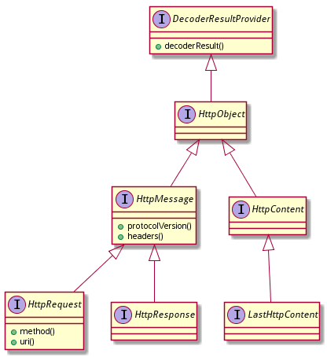

# http objects

## 接口定义

### 基本接口



- HttpObject: 标识接口，继承自`DecoderResultProvider`：

    ```java
    package io.netty.handler.codec.http;
    public interface HttpObject extends DecoderResultProvider { }
    ```

- HttpMessage: 定义HTTP消息，为`HttpRequest`和`HttpResponse`提供通用属性：

    ```java
    public interface HttpMessage extends HttpObject {
        HttpVersion protocolVersion();
        HttpHeaders headers();
    }
    ```

    所谓通用属性其实就只有两个：版本和header。

- HttpRequest: 对应HTTP request。

	访问查询参数和cookie。和servlet api不同的是，query string通过QueryStringEncoder和QueryStringDecoder来构建和拆解。

    ```java
    public interface HttpRequest extends HttpMessage {
        HttpMethod method();
        String uri();
    }
    ```

	和HttpMessage相比，HttpRequest增加了http methed和uri两个参数。

- HttpContent：是一个HTTP chunk，用于HTTP chunked 传输编码.

	当内容很大或者内容编码是chunked时，`HttpObjectDecoder`会在生成`HttpMessage`之后再生成`HttpContent`。如果不想在handler中接受到`HttpContent`，可以在`ChannelPipeline`中的`HttpObjectDecoder`之后放一个`HttpObjectAggregator`。

	`HttpContent`继承自`HttpObject`和`ByteBufHolder`：

    ```java
    public interface HttpContent extends HttpObject, ByteBufHolder {}
    ```

#### LastHttpContent

`LastHttpContent` 是最后一个`HttpContent`，带有trailing headers。

```java
public interface LastHttpContent extends HttpContent {
	HttpHeaders trailingHeaders();
}
```

### FullHttpMessage

FullHttpMessage用来合并HttpMessage和LastHttpContent到一个消息中，因此FullHttpMessage可以用来表示一个完整的http信息：

```java
public interface FullHttpMessage extends HttpMessage, LastHttpContent {}
```

### FullHttpRequest

合并HttpRequest和FullHttpMessage（实际指LastHttpContent）表示一个完整的http request：

```java
public interface FullHttpRequest extends HttpRequest, FullHttpMessage {}
```

### FullHttpResponse

合并HttpResponse和FullHttpMessage（实际指LastHttpContent）表示一个完整的http response：

```java
public interface FullHttpResponse extends HttpResponse, FullHttpMessage {}
```

### HttpResponse


## 实现类

### 类DefaultHttpObject


